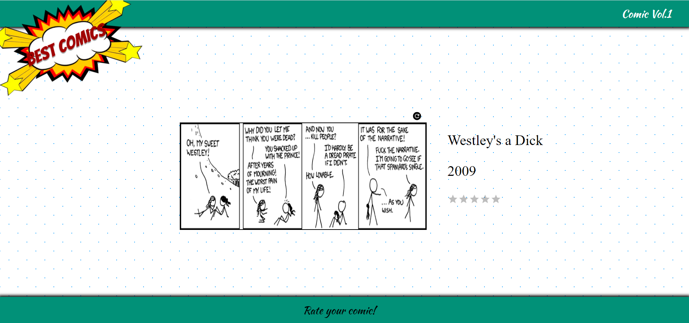

### Proyecto creado con create react app

Creado con Html-Css-Sass-Javascript-React

Para poder inicializarlo se debe clonar el repositorio y luego ejecutar en la terminal en la carpeta clonada npm install para instalar las dependencias que se encuentran en el package.json

Seguido de ello se debe ejecutar en la terminal npm start para que el proyecto se muestre en el localhost:3000

En el proyecto encontraremos una SPA que trae aleatoriamente un comic con su respectivo título, año de publicación e imagen; además tiene un sistema de estrellas para poder evaluar el comic. En la parte superior derecha de la imagen se encuentra un botón para poder traer aletoriamente un próximo comic y poder evaluarlo, el proyecto es totalmente responsive.
